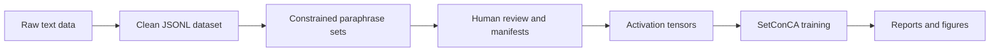
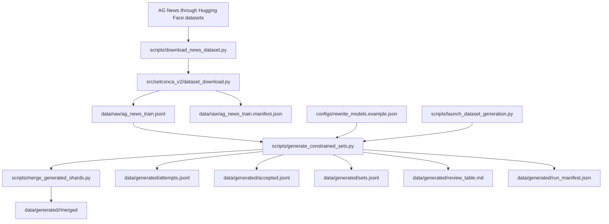
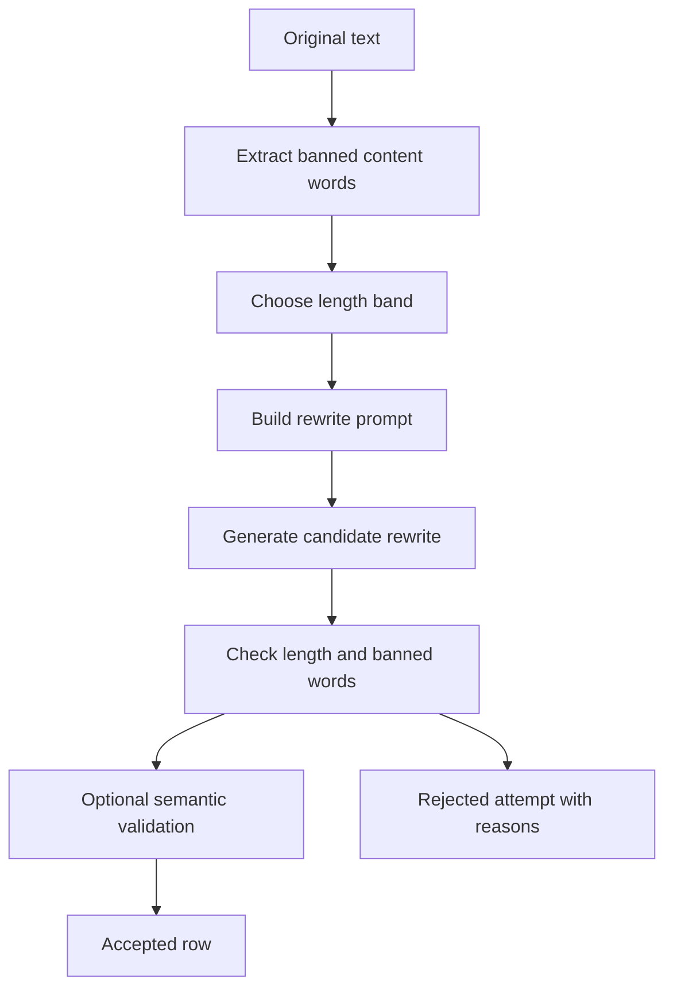
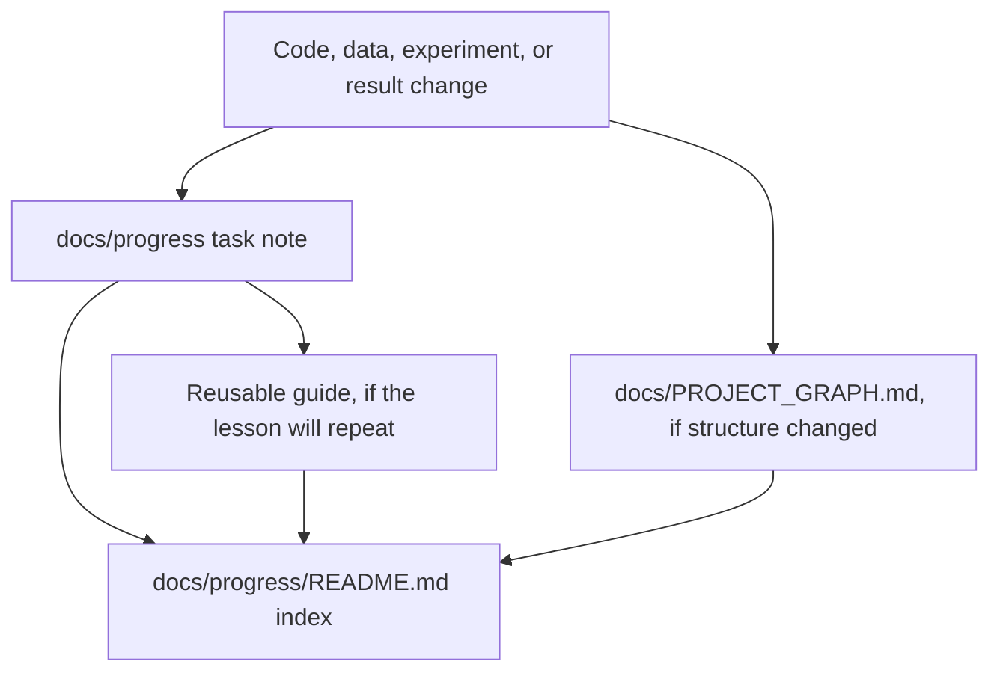

# SetConCA V2 Project Map

This document is the readable map of the current V2 project. It should stay simple enough to explain the system quickly, then link out to detailed progress notes when more evidence is needed.

Update rule: whenever the project structure, data pipeline, training path, or output artifacts change, update this map and add or update the matching note in `docs/progress`.

Related notes:

- [[README]]
- [[raw_json_to_dataset_guide]]
- [[2026-05-06_fresh_ag_news_dataset]]
- [[2026-05-06_constrained_paraphrase_pipeline]]
- [[2026-05-06_project_graph_documentation]]
- [[2026-05-06_project_graph_simplification]]
- [[2026-05-06_project_graph_refresh]]
- [[2026-05-06_progress_update_protocol]]
- [[multi_gpu_server_usage_guide]]
- [[2026-05-07_model_family_layer_grid_plan]]

## 1. Big Picture

SetConCA V2 builds controlled semantic sets from raw text, then uses those sets to study shared concepts in model activations.



Plain English:

1. Start with raw news text.
2. Normalize it into a clean dataset file.
3. Generate rewrites that preserve meaning but avoid copied words.
4. Save every accepted and rejected attempt.
5. Review the dataset before using it for activations.
6. Train and evaluate SetConCA on the resulting activation sets.

## 2. Current Folder Roles

| Folder | What It Means | Current Role |
| --- | --- | --- |
| `data/raw` | Raw normalized source rows | Holds `ag_news_train.jsonl` and its manifest. |
| `data/generated` | Generated dataset artifacts | Expected output for rewrite attempts, accepted rows, sets, review table, and run manifest. |
| `configs` | Experiment settings | Holds rewrite model and validation configuration. |
| `scripts` | Commands users run | Holds dataset download and constrained set generation scripts. |
| `src/setconca_v2` | Core V2 utilities | Holds formatting, IO, path, rewrite, constraint, and semantic-validation code. |
| `tests` | Regression checks | Tests dataset formatting and text constraints. |
| `docs/progress` | Lab notebook | One note per task, plus guides and evidence. |
| `data/generated/pilot_real_50` | Real pilot output | 50-original CUDA pilot with 15702 attempts and 796 accepted rewrites. |
| `data/generated/server_4gpu_2000/merged` | Large server dataset | 2000-original 4-GPU vLLM run with 29183 accepted rewrites and filtered `sets_min8.jsonl`. |
| `data/activations` | Activation banks | Stores `.pt` tensors shaped `[num_sets, views, hidden_dim]` for SetConCA training. |
| `data/generated/*/logs` | Server logs | Per-shard logs from multi-GPU launcher runs. |
| `results` | Final or experimental outputs | Currently reserved for later final results. |

## 3. Data Pipeline

This is the part that converts raw data into usable semantic sets.



Important idea:

`attempts.jsonl` is the full scientific audit trail. It keeps both failures and successes. `sets.jsonl` is the cleaned grouped dataset that later steps should use only after review.

More detail: [[raw_json_to_dataset_guide]]

## 4. Dataset Row Shapes

### Raw JSONL Row

```json
{
  "id": "ag_news_train_000000",
  "text": "Clean single-line source text.",
  "source": "hf:ag_news:train",
  "label": "business"
}
```

### Accepted Rewrite Row

```json
{
  "status": "accepted",
  "original_id": "ag_news_train_000000",
  "original_text": "Clean single-line source text.",
  "model_name": "example-model",
  "model_id": "provider/model-id",
  "length_band": "5-7",
  "rewrite": "Different wording keeps the meaning",
  "word_count": 5,
  "banned_words": ["source", "content"],
  "semantic_metrics": {}
}
```

### Grouped Set Row

```json
{
  "original_id": "ag_news_train_000000",
  "original_text": "Clean single-line source text.",
  "label": "business",
  "source": "hf:ag_news:train",
  "banned_words": ["source", "content"],
  "rewrites": [
    {
      "text": "Different wording keeps the meaning",
      "model_name": "example-model",
      "length_band": "5-7",
      "word_count": 5
    }
  ]
}
```

## 5. Core Code Map

| File | Simple Job |
| --- | --- |
| `scripts/download_news_dataset.py` | Run this to create raw JSONL from AG News. |
| `scripts/launch_dataset_generation.py` | Launch generation locally or as one vLLM shard process per GPU. |
| `scripts/merge_generated_shards.py` | Merge shard artifact folders into one dataset output. |
| `scripts/summarize_and_filter_sets.py` | Produce dataset statistics and filtered grouped-set files such as `sets_min8.jsonl`. |
| `scripts/extract_activation_bank.py` | Convert grouped semantic sets into activation-bank `.pt` tensors. |
| `scripts/train_setconca_v2.py` | Train SetConCA V2 from an activation-bank `.pt` file. |
| `scripts/run_activation_grid.py` | Run the model-family, size, and layer activation extraction grid locally or on a multi-GPU server. |
| `configs/activation_model_grid.json` | Defines Llama/Gemma/Qwen model grid, `sets_min16`, `S=16`, and 20/60/90 layer fractions. |
| `src/setconca_v2/dataset_download.py` | Normalize raw records and assign the V2 schema. |
| `src/setconca_v2/io_utils.py` | Read/write JSONL, group accepted rows, and write review tables. |
| `src/setconca_v2/paths.py` | Make paths work from different launch folders. |
| `src/setconca_v2/set_dataset.py` | Compute set dataset stats, hashes, and filters. |
| `src/setconca_v2/activation_extraction.py` | Sample semantic-set views and extract HF hidden states. |
| `scripts/generate_constrained_sets.py` | Run the full rewrite and validation pipeline with `hf` or `vllm`. |
| `src/setconca_v2/text_constraints.py` | Count words, ban copied words, and validate rewrite constraints. |
| `src/setconca_v2/rewrite_generation.py` | Build prompts and call rewrite models. |
| `src/setconca_v2/semantic_validation.py` | Optionally check meaning with embeddings and NLI. |

## 6. Generation Logic



Why this matters:

The dataset should not let a model solve the task by copying obvious words. The rewrite must preserve meaning while changing wording and respecting exact length bands.

## 7. Commands

Create raw AG News JSONL:

```powershell
python scripts\download_news_dataset.py `
  --dataset ag_news `
  --split train `
  --limit 1000 `
  --out data\raw\ag_news_train.jsonl
```

Run a small dry-run generation check:

```powershell
python scripts\generate_constrained_sets.py `
  --models-config configs\rewrite_models.example.json `
  --input data\raw\ag_news_train.jsonl `
  --out-dir data\generated `
  --max-originals 10 `
  --dry-run `
  --include-disabled
```

Run a single-GPU vLLM server pilot:

```bash
python scripts/launch_dataset_generation.py \
  --models-config configs/rewrite_models.example.json \
  --input data/raw/ag_news_train_full.jsonl \
  --out-dir data/generated/server_single_pilot \
  --backend vllm \
  --gpus 1 \
  --max-originals 10
```

Run a 4-GPU model-sharded vLLM server job:

```bash
python scripts/launch_dataset_generation.py \
  --models-config configs/rewrite_models.example.json \
  --input data/raw/ag_news_train_full.jsonl \
  --out-dir data/generated/server_vllm_4gpu \
  --backend vllm \
  --gpus 4 \
  --max-originals 1000
```

Summarize and filter the large merged dataset:

```powershell
python scripts\summarize_and_filter_sets.py `
  --input data\generated\server_4gpu_2000\merged\sets.jsonl `
  --out-dir data\generated\server_4gpu_2000\merged `
  --min-rewrites 8 `
  --filtered-name sets_min8.jsonl
```

Create a dry-run activation bank:

```powershell
python scripts\extract_activation_bank.py `
  --sets data\generated\server_4gpu_2000\merged\sets_min8.jsonl `
  --out data\activations\smoke_fake_min8_s8.pt `
  --model-id dry-run/mock `
  --layer -1 `
  --views 8 `
  --max-sets 3 `
  --dry-run `
  --fake-hidden-dim 32
```

Run real activation extraction:

```bash
uv run python scripts/extract_activation_bank.py \
  --sets data/generated/server_4gpu_2000/merged/sets_min8.jsonl \
  --out data/activations/gemma_2_2b_layer_-1_s8.pt \
  --model-id google/gemma-2-2b \
  --layer -1 \
  --views 8 \
  --batch-size 8 \
  --max-length 256 \
  --dtype bfloat16
```

Run the full model-family/layer activation grid on a 4-GPU server:

```bash
uv run python scripts/run_activation_grid.py \
  --config configs/activation_model_grid.json \
  --out-root data/activations/model_grid_s16_min16 \
  --gpus 4
```

Run a safe pilot first:

```bash
uv run python scripts/run_activation_grid.py \
  --config configs/activation_model_grid.json \
  --out-root data/activations/pilot_qwen3_small_s16 \
  --only-family qwen3 \
  --only-size small \
  --max-sets 25 \
  --gpus 1
```

Train SetConCA V2:

```bash
uv run python scripts/train_setconca_v2.py \
  --activations data/activations/gemma_2_2b_layer_-1_s8.pt \
  --out-dir results/train_gemma_2_2b_layer_-1_s8 \
  --epochs 50 \
  --batch-size 64 \
  --concept-dim 128 \
  --topk 32
```

More detail: [[multi_gpu_server_usage_guide]]

Run tests:

```powershell
pytest tests
```

## 8. Current Tests

| Test File | What It Protects |
| --- | --- |
| `tests/test_dataset_download.py` | Text normalization, AG News label mapping, V2 JSONL schema. |
| `tests/test_text_constraints.py` | Banned words, word counts, rewrite validation, grouping, review table writing, disabled semantic validator behavior. |

## 9. Current Recorded Results

| Output | Device | Originals | Models | Attempts | Accepted | Runtime |
| --- | --- | ---: | ---: | ---: | ---: | ---: |
| `data/generated/pilot_real_50` | RTX 3090 CUDA | 50 | 10 | 15702 | 796 | about 5.17 hours |
| `data/generated/server_4gpu_2000/merged` | 4 x A100 vLLM | 2000 | 10 | 641146 | 29183 | slowest shard about 39.2 minutes |
| `data/activations/smoke_fake_min8_s8.pt` | Dry run | 3 sets | 8 views | hidden dim 32 | loader-compatible | under 1 second |
| `results/smoke_train_fake_min8_s8` | CPU smoke | 3 sets | 8 views | 3 epochs | checkpoint + metrics | succeeded |

The server run is the first large semantic-set dataset. The recommended first activation input is `data/generated/server_4gpu_2000/merged/sets_min8.jsonl`, which keeps 1928 sets with at least 8 accepted rewrites each. More detail: [[2026-05-07_server_4gpu_2000_dataset_qa]].

For the model-family/layer/set-size sweep, use `data/generated/server_4gpu_2000/merged/sets_min16.jsonl`. It has 805 sets with at least 16 rewrites, which supports a fair sweep over `S = 2, 4, 6, 8, 10, 12, 14, 16`. More detail: [[2026-05-07_model_family_layer_grid_plan]] and [[EXPERIMENT_REPORT]].

## 10. Known Risks

| Risk | Why It Matters | Next Action |
| --- | --- | --- |
| Some raw text may contain escaped artifacts like `\\band`. | Bad source text can create bad prompts. | Measure how often this occurs, then add a cleaning rule if needed. |
| Banned-word checks are exact-token only. | Inflections and near-copies may pass. | Add lemmatization or stemming checks. |
| Semantic validation is disabled by default. | Meaning drift can pass length and banned-word checks. | Enable embedding validation in a pilot and compare manual review. |
| vLLM is Linux/CUDA-oriented. | Windows local runs may not match server behavior. | Validate with a small server pilot before full runs. |
| Multi-GPU generation uses model shards, not distributed training. | It accelerates dataset generation but does not yet train SetConCA across GPUs. | Add training-specific docs when distributed training exists. |
| Rewrite models are enabled in the current example config. | Real generation can download and run many large models. | Use small pilots and document model access/config before large jobs. |

## 11. Documentation Flow

This is how project knowledge should move from work to reusable documentation.



Documentation rule:

- Use one progress note per task.
- Use guides for reusable procedures.
- Update this map when folders, data flow, commands, tests, or outputs change.
- If the user says `update`, sync the relevant progress notes using the current work.

## 12. Keep This Updated

When something changes, update this file in the smallest useful way:

| If This Changes | Update This Section |
| --- | --- |
| New data source or schema | Sections 2, 3, and 4 |
| New script or module | Sections 2 and 5 |
| New generation or validation logic | Sections 6 and 9 |
| New commands | Section 7 |
| New tests | Section 8 |
| New results path or artifact | Sections 2, 3, and 9 |
| New server workflow | Sections 2, 3, 5, 7, 10, and [[multi_gpu_server_usage_guide]] |

Also update or create a matching note in `docs/progress`.
