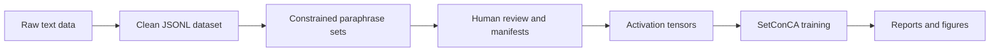
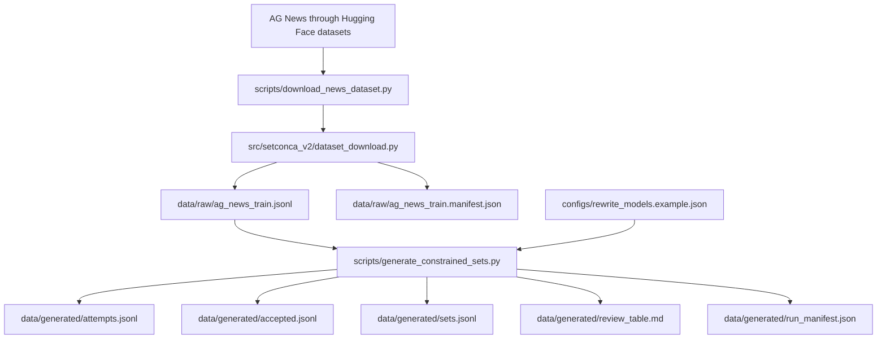
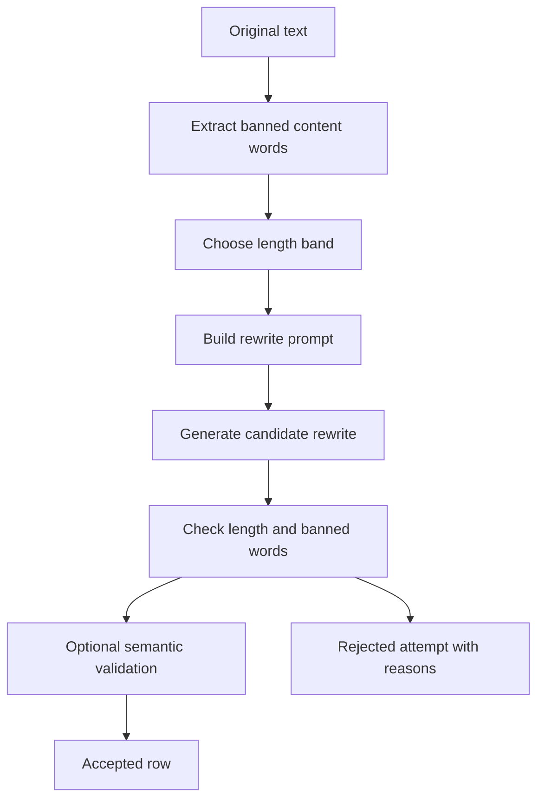
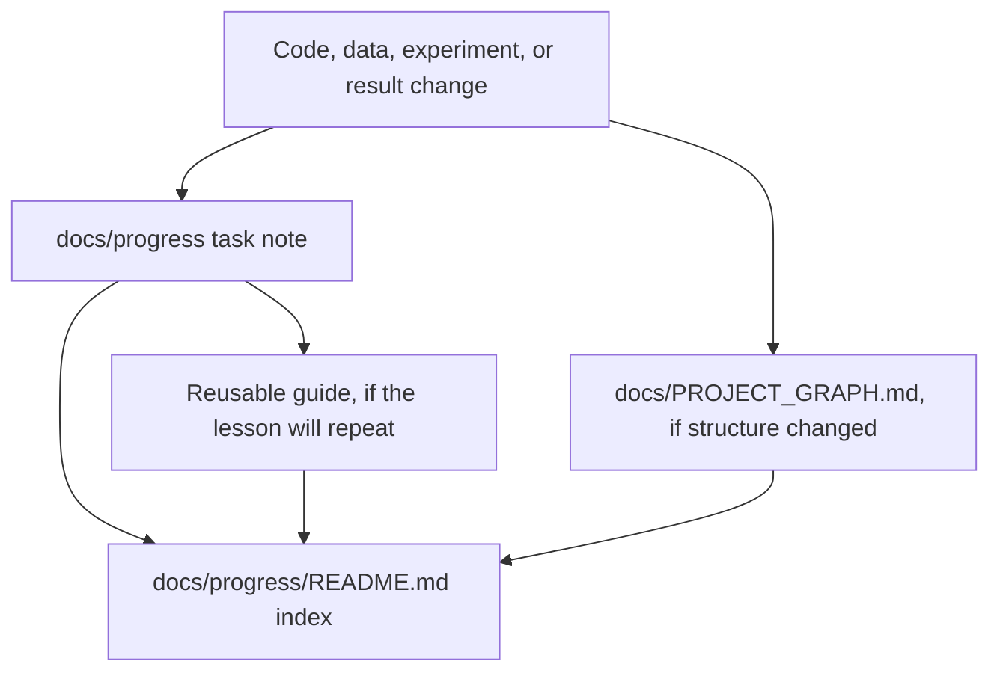

# SetConCA V2 Project Map

This document is the readable map of the current V2 project. It should stay simple enough to explain the system quickly, then link out to detailed progress notes when more evidence is needed.

Update rule: whenever the project structure, data pipeline, training path, or output artifacts change, update this map and add or update the matching note in `docs/progress`.

Related notes:

- [[README]]
- [[raw_json_to_dataset_guide]]
- [[2026-05-06_fresh_ag_news_dataset]]
- [[2026-05-06_constrained_paraphrase_pipeline]]
- [[2026-05-06_project_graph_documentation]]
- [[2026-05-06_project_graph_simplification]]
- [[2026-05-06_project_graph_refresh]]
- [[2026-05-06_progress_update_protocol]]

## 1. Big Picture

SetConCA V2 builds controlled semantic sets from raw text, then uses those sets to study shared concepts in model activations.



Plain English:

1. Start with raw news text.
2. Normalize it into a clean dataset file.
3. Generate rewrites that preserve meaning but avoid copied words.
4. Save every accepted and rejected attempt.
5. Review the dataset before using it for activations.
6. Train and evaluate SetConCA on the resulting activation sets.

## 2. Current Folder Roles

| Folder | What It Means | Current Role |
| --- | --- | --- |
| `data/raw` | Raw normalized source rows | Holds `ag_news_train.jsonl` and its manifest. |
| `data/generated` | Generated dataset artifacts | Expected output for rewrite attempts, accepted rows, sets, review table, and run manifest. |
| `configs` | Experiment settings | Holds rewrite model and validation configuration. |
| `scripts` | Commands users run | Holds dataset download and constrained set generation scripts. |
| `src/setconca_v2` | Core V2 utilities | Holds formatting, IO, path, rewrite, constraint, and semantic-validation code. |
| `tests` | Regression checks | Tests dataset formatting and text constraints. |
| `docs/progress` | Lab notebook | One note per task, plus guides and evidence. |
| `results` | Final or experimental outputs | Currently reserved for later results. |

## 3. Data Pipeline

This is the part that converts raw data into usable semantic sets.



Important idea:

`attempts.jsonl` is the full scientific audit trail. It keeps both failures and successes. `sets.jsonl` is the cleaned grouped dataset that later steps should use only after review.

More detail: [[raw_json_to_dataset_guide]]

## 4. Dataset Row Shapes

### Raw JSONL Row

```json
{
  "id": "ag_news_train_000000",
  "text": "Clean single-line source text.",
  "source": "hf:ag_news:train",
  "label": "business"
}
```

### Accepted Rewrite Row

```json
{
  "status": "accepted",
  "original_id": "ag_news_train_000000",
  "original_text": "Clean single-line source text.",
  "model_name": "example-model",
  "model_id": "provider/model-id",
  "length_band": "5-7",
  "rewrite": "Different wording keeps the meaning",
  "word_count": 5,
  "banned_words": ["source", "content"],
  "semantic_metrics": {}
}
```

### Grouped Set Row

```json
{
  "original_id": "ag_news_train_000000",
  "original_text": "Clean single-line source text.",
  "label": "business",
  "source": "hf:ag_news:train",
  "banned_words": ["source", "content"],
  "rewrites": [
    {
      "text": "Different wording keeps the meaning",
      "model_name": "example-model",
      "length_band": "5-7",
      "word_count": 5
    }
  ]
}
```

## 5. Core Code Map

| File | Simple Job |
| --- | --- |
| `scripts/download_news_dataset.py` | Run this to create raw JSONL from AG News. |
| `src/setconca_v2/dataset_download.py` | Normalize raw records and assign the V2 schema. |
| `src/setconca_v2/io_utils.py` | Read/write JSONL, group accepted rows, and write review tables. |
| `src/setconca_v2/paths.py` | Make paths work from different launch folders. |
| `scripts/generate_constrained_sets.py` | Run the full rewrite and validation pipeline. |
| `src/setconca_v2/text_constraints.py` | Count words, ban copied words, and validate rewrite constraints. |
| `src/setconca_v2/rewrite_generation.py` | Build prompts and call rewrite models. |
| `src/setconca_v2/semantic_validation.py` | Optionally check meaning with embeddings and NLI. |

## 6. Generation Logic



Why this matters:

The dataset should not let a model solve the task by copying obvious words. The rewrite must preserve meaning while changing wording and respecting exact length bands.

## 7. Commands

Create raw AG News JSONL:

```powershell
python scripts\download_news_dataset.py `
  --dataset ag_news `
  --split train `
  --limit 1000 `
  --out data\raw\ag_news_train.jsonl
```

Run a small dry-run generation check:

```powershell
python scripts\generate_constrained_sets.py `
  --models-config configs\rewrite_models.example.json `
  --input data\raw\ag_news_train.jsonl `
  --out-dir data\generated `
  --max-originals 10 `
  --dry-run `
  --include-disabled
```

Run tests:

```powershell
pytest tests
```

## 8. Current Tests

| Test File | What It Protects |
| --- | --- |
| `tests/test_dataset_download.py` | Text normalization, AG News label mapping, V2 JSONL schema. |
| `tests/test_text_constraints.py` | Banned words, word counts, rewrite validation, grouping, review table writing, disabled semantic validator behavior. |

## 9. Known Risks

| Risk | Why It Matters | Next Action |
| --- | --- | --- |
| Some raw text may contain escaped artifacts like `\\band`. | Bad source text can create bad prompts. | Measure how often this occurs, then add a cleaning rule if needed. |
| Banned-word checks are exact-token only. | Inflections and near-copies may pass. | Add lemmatization or stemming checks. |
| Semantic validation is disabled by default. | Meaning drift can pass length and banned-word checks. | Enable embedding validation in a pilot and compare manual review. |
| Rewrite models are disabled in the example config. | Real generation needs deliberate local configuration. | Create a machine-specific config and document it in `docs/progress`. |

## 10. Documentation Flow

This is how project knowledge should move from work to reusable documentation.



Documentation rule:

- Use one progress note per task.
- Use guides for reusable procedures.
- Update this map when folders, data flow, commands, tests, or outputs change.
- If the user says `update`, sync the relevant progress notes using the current work.

## 11. Keep This Updated

When something changes, update this file in the smallest useful way:

| If This Changes | Update This Section |
| --- | --- |
| New data source or schema | Sections 2, 3, and 4 |
| New script or module | Sections 2 and 5 |
| New generation or validation logic | Sections 6 and 9 |
| New commands | Section 7 |
| New tests | Section 8 |
| New results path or artifact | Sections 2 and 3 |

Also update or create a matching note in `docs/progress`.
