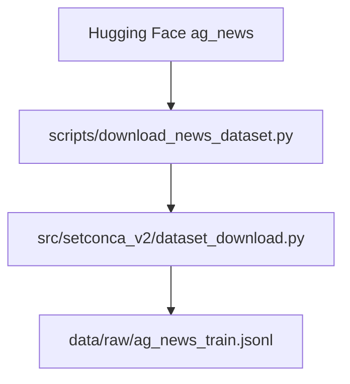

# Task: Project Graph Documentation

Tags: #progress #documentation #graph #mermaid

Related notes: [[README]] [[2026-05-06_v2_clean_restart]] [[2026-05-06_constrained_paraphrase_pipeline]]

## 1. Goal

Respond to `/graphify .` by documenting the current SetConCA V2 project as a reusable graph rather than a one-off chat answer.

## 2. Context

| Field | Value |
| --- | --- |
| Date | 2026-05-06 |
| Workspace | `C:\Users\MPC\Documents\code\SetConCA\SetConCA_V2` |
| Output file | `docs/PROJECT_GRAPH.md` |
| Graph format | Mermaid |

## 3. Hypothesis Or Rationale

A graph is useful at this stage because the codebase has several distinct flows: dataset download, constrained rewrite generation, validation, artifact writing, activation-bank loading, model training, and tests. Mermaid keeps the diagram editable in Markdown.

## 4. Actions

| Step | Action | Why | Result | Status |
| --- | --- | --- | --- | --- |
| 1 | Inspected the repository tree. | Needed to identify the real project modules. | Found `configs`, `data`, `docs`, `model`, `scripts`, `src`, `tests`, and `training`. | Succeeded |
| 2 | Read core scripts and modules. | Needed to map true dependencies. | Confirmed dataset-generation and model-training paths. | Succeeded |
| 3 | Added system-flow Mermaid graph. | Needed a high-level end-to-end picture. | Graph covers raw data, generation, validation, artifacts, activation loading, model, losses, tests. | Succeeded |
| 4 | Added package dependency graph. | Needed code-level navigation. | Graph links scripts, package modules, learning modules, and tests. | Succeeded |
| 5 | Added data-contract graph. | Needed schema-level understanding. | Graph covers `DatasetRow`, attempt rows, semantic sets, `ActivationSetBank`, `ForwardOutput`, and loss parts. | Succeeded |

## 5. Code And Pseudocode

Example graph style:

## 6. Results

### File Created

| File | Contents |
| --- | --- |
| `docs/PROJECT_GRAPH.md` | System flow, package dependency graph, main data-contract graph, and implementation notes. |

### Figures And Images

No raster images were produced. The diagrams are Mermaid code blocks rendered by Markdown tools that support Mermaid.

## 7. Interpretation

The project graph makes the current V2 architecture easier to audit. It also exposes what is still missing: activation extraction, full training runner, and final evaluation orchestration.

## 8. Successes

The documentation succeeded because it is stored inside the repo and follows the actual files rather than inventing an architecture diagram detached from the code.

## 9. Failures Or Limits

The graph is static. It must be updated after major implementation changes.

## 10. External Works And Papers

No external paper was used. Mermaid was used as a Markdown diagram format.

## 11. Files Changed

| File | Change | Reason |
| --- | --- | --- |
| `docs/PROJECT_GRAPH.md` | Added reusable Mermaid architecture documentation. | Document `/graphify .` result. |

## 12. Follow-Up

- [ ] Update the graph when activation extraction scripts are added.
- [ ] Add a result-flow graph after the first real pilot generation run.
