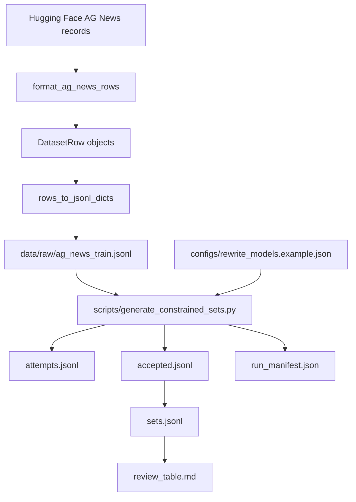

# Guide: Raw JSON/JSONL To SetConCA V2 Dataset

Tags: #guide #dataset #jsonl #data-pipeline #setconca-v2

Related notes: [[README]] [[2026-05-06_fresh_ag_news_dataset]] [[2026-05-06_constrained_paraphrase_pipeline]] [[2026-05-06_project_graph_documentation]]

Related project map: [[PROJECT_GRAPH]]

## 1. Purpose

This guide explains how raw text data becomes the SetConCA V2 dataset artifacts. It starts from raw AG News records loaded from Hugging Face, formats them into a clean JSONL file, then runs constrained paraphrase generation to create semantic sets for later activation extraction and model training.

In this project, "JSON" means one structured object. "JSONL" means one JSON object per line. We use JSONL for datasets because it is easy to stream, inspect, append, and recover if a long run stops.

## 2. Pipeline Summary



## 3. Main Files

| File | Role |
| --- | --- |
| `scripts/download_news_dataset.py` | CLI entry point for creating fresh raw V2 data. |
| `src/setconca_v2/dataset_download.py` | Normalizes AG News rows and converts them to the V2 schema. |
| `src/setconca_v2/io_utils.py` | Reads/writes JSON and JSONL, groups accepted rewrites, writes review tables. |
| `src/setconca_v2/paths.py` | Resolves paths correctly whether scripts are run from repo root or `SetConCA_V2`. |
| `scripts/generate_constrained_sets.py` | Runs constrained rewrite generation and writes dataset artifacts. |
| `configs/rewrite_models.example.json` | Controls rewrite models, generation parameters, prompt, and semantic validation. |
| `src/setconca_v2/text_constraints.py` | Extracts banned words, counts words, enforces length and banned-word constraints. |
| `src/setconca_v2/rewrite_generation.py` | Builds prompts and runs either Hugging Face generation or dry-run generation. |
| `src/setconca_v2/semantic_validation.py` | Optionally checks meaning preservation using embeddings and NLI. |
| `docs/PROJECT_GRAPH.md` | High-level graph of how the current project modules connect. |

## 4. Step 1: Load Raw Data

The raw source is AG News from Hugging Face Datasets.

Command:

```powershell
python scripts\download_news_dataset.py `
  --dataset ag_news `
  --split train `
  --limit 1000 `
  --out data\raw\ag_news_train.jsonl
```

What happens:

```python
from datasets import load_dataset

ds = load_dataset("ag_news", split="train")
```

Why we do this:

AG News gives us short news texts with labels. That makes it useful for a controlled first dataset because examples are compact, easy to inspect, and have broad topics such as business, sports, world, and science/technology.

## 5. Step 2: Normalize Text

Code owner: `src/setconca_v2/dataset_download.py`

The function `normalize_news_text` converts each raw text field into a cleaner single-line string.

Core behavior:

```python
def normalize_news_text(text: str, *, max_chars: int = 500) -> str:
    text = " ".join(str(text).replace("\\n", " ").split())
    if len(text) > max_chars:
        text = text[:max_chars].rsplit(" ", 1)[0].strip()
    return text
```

Why we do this:

| Problem In Raw Text | Fix | Reason |
| --- | --- | --- |
| Newlines and inconsistent spacing | Collapse whitespace | Keeps JSONL rows readable and stable. |
| Very long text | Truncate to a word boundary | Keeps prompt size controlled. |
| Non-string values | Convert with `str(text)` | Prevents simple type surprises. |

Result:

```json
{
  "id": "ag_news_train_000000",
  "label": "business",
  "source": "hf:ag_news:train",
  "text": "Wall St. Bears Claw Back Into the Black (Reuters) Reuters - Short-sellers, Wall Street's dwindling\\band of ultra-cynics, are seeing green again."
}
```

Note: the observed sample contains `\\band`, which looks like an escaped source artifact from the raw dataset text. The current normalization removes actual newline characters but does not yet repair embedded backslash-letter artifacts. That should be checked before a final large run.

## 6. Step 3: Convert Raw Records To V2 Rows

Code owner: `format_ag_news_rows`.

Schema:

| Field | Type | Meaning |
| --- | --- | --- |
| `id` | string | Stable local row ID such as `ag_news_train_000123`. |
| `text` | string | Normalized source text. |
| `source` | string | Provenance string such as `hf:ag_news:train`. |
| `label` | string or null | Human-readable AG News class. |
| `title` | string or null | Optional field, only written when present. |

Label mapping:

| Raw label | V2 label |
| ---: | --- |
| 0 | `world` |
| 1 | `sports` |
| 2 | `business` |
| 3 | `science_technology` |

Pseudocode:

```text
rows = []
for idx, raw_record in enumerate(records):
    if limit reached:
        stop

    text = normalize_news_text(raw_record["text"])
    if text is empty:
        skip row

    label = AG_NEWS_LABELS[raw_record["label"]]

    rows.append(DatasetRow(
        id = "ag_news_<split>_<zero padded idx>",
        text = text,
        source = "hf:ag_news:<split>",
        label = label
    ))
```

Why this succeeds:

The row ID, source string, and manifest make the dataset auditable. We can trace a later rewrite or activation back to one original text row.

## 7. Step 4: Write JSONL And Manifest

Code owners: `rows_to_jsonl_dicts`, `write_jsonl`, `write_json`.

The script writes two files:

| Output | Purpose |
| --- | --- |
| `data/raw/ag_news_train.jsonl` | The raw normalized V2 source rows. |
| `data/raw/ag_news_train.manifest.json` | Dataset provenance, count, split, limit, path, and schema. |

Manifest currently records:

```json
{
  "dataset": "ag_news",
  "split": "train",
  "limit": 1000,
  "n_rows": 1000,
  "format": {
    "id": "string",
    "text": "string",
    "source": "string",
    "label": "string|null"
  }
}
```

Why we do this:

The JSONL is the actual dataset input. The manifest is the scientific receipt. It records what we intended to download and what file was produced.

## 8. Step 5: Configure Rewrite Generation

Config file: `configs/rewrite_models.example.json`

Important sections:

| Section | Meaning |
| --- | --- |
| `models` | Candidate Hugging Face rewrite models. Disabled by default in the example. |
| `generation` | Sampling settings such as temperature, top-p, max tokens, and attempts per slot. |
| `prompting.template` | The instruction used to ask a model for a constrained rewrite. |
| `semantic_validation` | Optional embedding/NLI checks for meaning preservation. |

Before a real run, copy or edit the config so at least one model has:

```json
{
  "name": "qwen2.5-1.5b-instruct",
  "model_id": "Qwen/Qwen2.5-1.5B-Instruct",
  "enabled": true
}
```

Why we keep models disabled in the example:

It prevents accidental huge downloads or GPU memory use. A real experiment should deliberately choose model IDs available on the machine.

## 9. Step 6: Generate Constrained Sets

Dry-run command:

```powershell
python scripts\generate_constrained_sets.py `
  --models-config configs\rewrite_models.example.json `
  --input data\raw\ag_news_train.jsonl `
  --out-dir data\generated `
  --max-originals 10 `
  --dry-run `
  --include-disabled
```

Real model command:

```powershell
python scripts\generate_constrained_sets.py `
  --models-config configs\rewrite_models.example.json `
  --input data\raw\ag_news_train.jsonl `
  --out-dir data\generated `
  --max-originals 10
```

Use a small `--max-originals` first. If the pilot produces good review rows, increase it.

Server command with vLLM:

```bash
python scripts/launch_dataset_generation.py \
  --models-config configs/rewrite_models.example.json \
  --input data/raw/ag_news_train_full.jsonl \
  --out-dir data/generated/server_single_pilot \
  --backend vllm \
  --gpus 1 \
  --max-originals 10
```

Multi-GPU server command:

```bash
python scripts/launch_dataset_generation.py \
  --models-config configs/rewrite_models.example.json \
  --input data/raw/ag_news_train_full.jsonl \
  --out-dir data/generated/server_vllm_4gpu \
  --backend vllm \
  --gpus 4 \
  --max-originals 1000
```

More detail: [[multi_gpu_server_usage_guide]]

## 10. Step 7: Build The Prompt

Code owner: `build_prompt` in `rewrite_generation.py`.

Each prompt includes:

| Prompt Part | Reason |
| --- | --- |
| Original sentence | Gives the semantic content to preserve. |
| Forbidden words | Reduces trivial copying from the original. |
| Required length band | Creates controlled variation across short and long rewrites. |
| Preservation rules | Keeps entities, polarity, time, and event relation stable. |
| "Final rewrite only" | Reduces explanations and formatting noise. |

Pseudocode:

```text
banned_words = extract_banned_words(original_text)
for length_band in ["5-7", "10-12", "15-17", "20-22"]:
    prompt = template.format(
        original = original_text,
        banned_words = ", ".join(banned_words),
        min_words = length_band.min_words,
        max_words = length_band.max_words
    )
```

## 11. Step 8: Extract Banned Words

Code owner: `extract_banned_words` in `text_constraints.py`.

The banned-word function:

1. Tokenizes the original text.
2. Lowercases tokens.
3. Removes stopwords like `the`, `and`, `with`, `during`.
4. Removes short words and pure numbers.
5. Counts repeated content words.
6. Ranks by frequency, length, then alphabetic order.
7. Keeps up to 8 banned words by default.

Why we do this:

SetConCA should learn shared meaning, not easy word overlap. Banned words make the rewrite model express the same event with different surface words.

Limit:

The current check is exact-token based. It catches `cloud` if the rewrite uses `cloud`, but it does not catch `clouds`. The prompt asks the model to avoid near-copies, but code does not fully enforce morphology yet.

## 12. Step 9: Validate Each Candidate Rewrite

Each candidate is checked by `validate_rewrite`.

Validation table:

| Check | Failure Reason Example |
| --- | --- |
| Word count below or above length band | `word_count=8, expected=5-7` |
| Contains banned word | `banned_words=market,stocks` |
| Empty or too short | `empty_or_too_short` |

Optional semantic validation can add:

| Check | Metric |
| --- | --- |
| Sentence embedding cosine | `embedding_cosine` |
| Natural language inference entailment | `entailment` |
| Natural language inference contradiction | `contradiction` |

Why this succeeds:

The pipeline does not silently keep bad rows. Every generated candidate gets a status and reasons. That gives us a record of both success and failure.

## 13. Step 10: Write Dataset Artifacts

The generation script writes four main artifacts plus a manifest:

| Artifact | Contents | Why It Matters |
| --- | --- | --- |
| `attempts.jsonl` | Every candidate, accepted or rejected. | Full audit trail. |
| `accepted.jsonl` | First accepted candidate for each original/model/length slot. | Clean rows for set construction. |
| `sets.jsonl` | Rewrites grouped by original sentence. | Main semantic-set dataset. |
| `review_table.md` | Human-readable table. | Manual inspection and reporting. |
| `run_manifest.json` | Config path, input, device, counts, bands, timing. | Reproducibility. |
| `logs/shard_*.log` | Per-shard logs when using the multi-GPU launcher. | Server debugging and failure recovery. |

Grouped set shape:

```json
{
  "original_id": "ag_news_train_000000",
  "original_text": "Original source text...",
  "label": "business",
  "source": "hf:ag_news:train",
  "banned_words": ["markets", "reuters"],
  "rewrites": [
    {
      "text": "A valid constrained rewrite.",
      "model_name": "qwen2.5-1.5b-instruct",
      "model_id": "Qwen/Qwen2.5-1.5B-Instruct",
      "length_band": "5-7",
      "word_count": 5,
      "semantic_metrics": {}
    }
  ]
}
```

## 14. Step 11: Review Before Training

Open:

```text
data/generated/review_table.md
```

Manual review should ask:

| Question | Good Sign | Bad Sign |
| --- | --- | --- |
| Does the rewrite preserve the same fact? | Same entities and relation. | New event, wrong polarity, missing key actor. |
| Did it avoid banned words? | No exact copied content words. | Obvious copied terms. |
| Is length correct? | Word count inside band. | Too short or too long. |
| Is it fluent? | Natural sentence. | Fragment, list, instruction text. |
| Is it varied? | Different syntax and vocabulary. | Nearly identical paraphrase. |

Only after review should we use `sets.jsonl` for activation extraction.

## 15. Current Recorded Pilot Baseline

The workspace contains a real pilot output:

```text
data/generated/pilot_real_50
```

| Metric | Value |
| --- | ---: |
| Device | CUDA |
| GPU | NVIDIA GeForce RTX 3090 |
| Input | `data/raw/ag_news_train_full.jsonl` |
| Originals | 50 |
| Models | 10 |
| Attempts | 15702 |
| Accepted | 796 |
| Runtime | 18597.3 seconds, about 5.17 hours |

Interpretation:

The pilot confirms the full data path can produce accepted constrained rewrites. It also shows why server sharding or vLLM batching is necessary before large runs.

## 16. Full Pipeline Checklist

- [ ] Decide dataset source and split.
- [ ] Run `scripts/download_news_dataset.py`.
- [ ] Inspect `data/raw/ag_news_train.manifest.json`.
- [ ] Inspect first rows of `data/raw/ag_news_train.jsonl`.
- [ ] Choose or enable rewrite models in config.
- [ ] Run a dry-run or 10-row pilot.
- [ ] For server runs, read [[multi_gpu_server_usage_guide]] and start with a small vLLM pilot.
- [ ] Inspect `attempts.jsonl` rejection reasons.
- [ ] Inspect `review_table.md`.
- [ ] Record results in a progress note.
- [ ] Increase `--max-originals` only after pilot quality is acceptable.

## 17. External Works And Technology Sources

| Work Or Tool | Link | Core Objective | How We Use It |
| --- | --- | --- | --- |
| Character-level Convolutional Networks for Text Classification, Zhang et al. 2015 | [arXiv 1509.01626](https://arxiv.org/abs/1509.01626) | Introduced large-scale text classification benchmarks and popularized AG News as a compact news classification dataset. | We use AG News as the initial source of original sentences for V2 dataset construction. |
| Hugging Face Datasets | [Documentation](https://huggingface.co/docs/datasets) | Standardize dataset loading and caching with a common Python API. | `load_dataset("ag_news", split="train")` loads the raw AG News records. |
| Sentence-BERT, Reimers and Gurevych 2019 | [arXiv 1908.10084](https://arxiv.org/abs/1908.10084) | Create sentence embeddings suitable for cosine similarity comparison. | Optional semantic validation can reject rewrites with low embedding cosine similarity. |
| MultiNLI, Williams et al. 2018 | [arXiv 1704.05426](https://arxiv.org/abs/1704.05426) | Train and evaluate natural language inference models across many genres. | Optional NLI validation can check entailment and contradiction between original and rewrite. |
| vLLM / PagedAttention, Kwon et al. 2023 | [arXiv 2309.06180](https://arxiv.org/abs/2309.06180) | Increase LLM generation throughput with efficient KV-cache memory management. | Server rewrite generation can use the `vllm` backend for batching and tensor parallelism. |

## 18. Current Known Risks

| Risk | Why It Matters | Proposed Fix |
| --- | --- | --- |
| Embedded source artifacts like `\\band` may survive normalization. | Bad text can produce strange prompts and rewrites. | Add a cleaning pass for suspicious backslash-letter artifacts and document before/after counts. |
| Banned-word matching is exact-token only. | Inflections and close copies can survive. | Add lemmatization or stem-based banned-word validation. |
| Semantic validation disabled by default. | Meaning drift may pass if only length and banned words are checked. | Enable embedding validation for pilot runs, then compare manual review quality. |
| Current example models are enabled. | A full command may download and run many large models. | Use `--max-originals` pilots and record the exact config before full server runs. |
| Server behavior differs from Windows local behavior. | vLLM is Linux/CUDA-oriented. | Validate on the actual server and save logs/manifests. |
